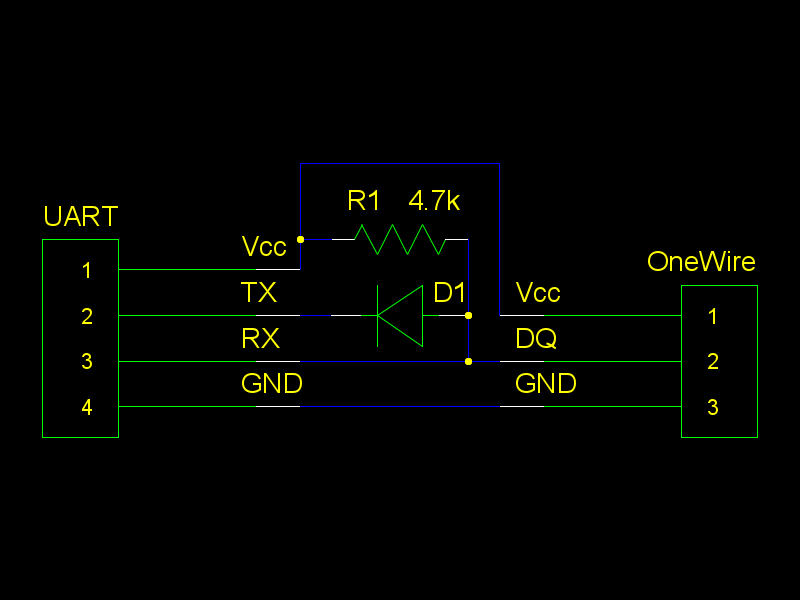
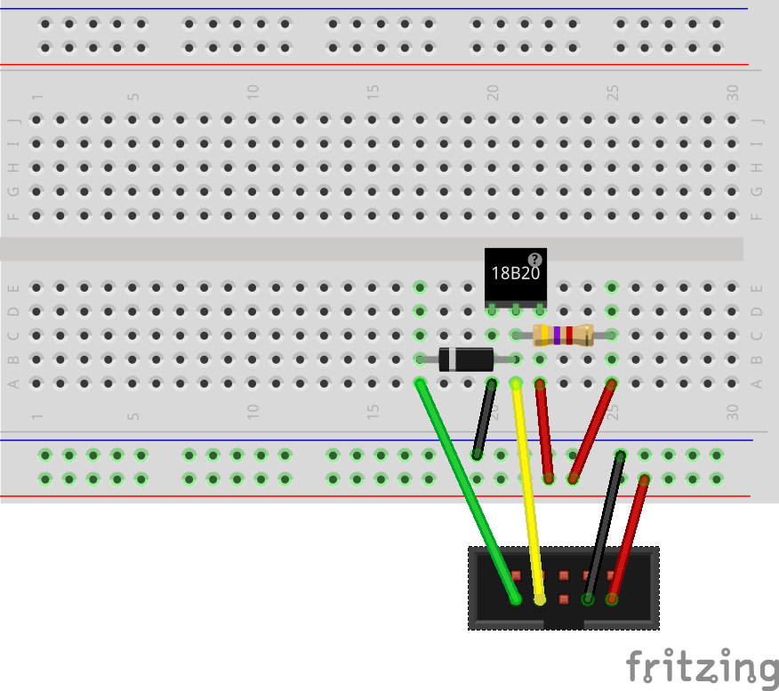

DS18B20 driver for Android Things
================================

This driver supports Dallas Semiconductor [OneWire] [DS18B20] temperature sensor connected to UART.
It may also support DS1920 and other sensors, but have not been tested with those.

NOTE: these drivers are not production-ready. They are offered as sample
implementations of Android Things user space drivers for common peripherals
as part of the Developer Preview release. There is no guarantee
of correctness, completeness or robustness.

Current Limitatios
---------------------

- Only one device open at the time per UART is supported.
- The device ID discovery is not implemented.
- Only active (powered) mode is supported.

Sensor connection
---------------------

I've wired the sensor using the simplified diagram on [onewire-over-uart] project:



My breadboard prototype looked this way:

- Red - 3.3v
- Black - GND
- Yellow - UART RX
- Green - UART TX



How to use the driver
---------------------

### Gradle dependency

To use the `Ds18b20` driver, simply add the line below to your project's `build.gradle`,
where `<version>` matches the last version of the driver available on [jcenter][jcenter].

```
dependencies {
    compile 'com.google.android.things.contrib:driver-ds18b20:<version>'
}
```

### Sample usage

```java
import com.google.android.things.contrib.driver.onewire.Ds18b20;

// Access the temperature sensor:

Ds18b20 mDs18b20;

try {
    mDs18b20 = new Ds18b20(uartBusName);
} catch (IOException e) {
    // couldn't configure the device...
}

// Read the current temperature:

try {
    float temperature = mDs18b20.readTemperature();
} catch (IOException e) {
    // error reading temperature
}

// Close the environmental sensor when finished:

try {
    mDs18b20.close();
} catch (IOException e) {
    // error closing sensor
}
```

If you need to read sensor values continuously, you can register the Ds18b20 with the system and
listen for sensor values using the [Sensor APIs][sensors]:
```java
SensorManager mSensorManager = getSystemService(Context.SENSOR_SERVICE);
SensorEventListener mListener = ...;
Ds18b20SensorDriver mSensorDriver;

mSensorManager.registerDynamicSensorCallback(new SensorManager.DynamicSensorCallback() {
    @Override
    public void onDynamicSensorConnected(Sensor sensor) {
        if (sensor.getType() == Sensor.TYPE_AMBIENT_TEMPERATURE) {
            mSensorManager.registerListener(mListener, sensor,
                    SensorManager.SENSOR_DELAY_NORMAL);
        }
    }
});

try {
    mSensorDriver = new Ds18b20SensorDriver(i2cBusName);
    mSensorDriver.registerTemperatureSensor();
} catch (IOException e) {
    // Error configuring sensor
}

// Unregister and close the driver when finished:

mSensorManager.unregisterListener(mListener);
mSensorDriver.unregisterTemperatureSensor();
try {
    mSensorDriver.close();
} catch (IOException e) {
    // error closing sensor
}
```

License
-------

Copyright 2018 Google Inc.

Licensed to the Apache Software Foundation (ASF) under one or more contributor
license agreements.  See the NOTICE file distributed with this work for
additional information regarding copyright ownership.  The ASF licenses this
file to you under the Apache License, Version 2.0 (the "License"); you may not
use this file except in compliance with the License.  You may obtain a copy of
the License at

  http://www.apache.org/licenses/LICENSE-2.0

Unless required by applicable law or agreed to in writing, software
distributed under the License is distributed on an "AS IS" BASIS, WITHOUT
WARRANTIES OR CONDITIONS OF ANY KIND, either express or implied.  See the
License for the specific language governing permissions and limitations under
the License.

[OneWire]: https://files.maximintegrated.com/sia_bu/public/owpd310r2.zip
[DS18B20]: https://datasheets.maximintegrated.com/en/ds/DS18B20.pdf
[jcenter]: https://bintray.com/google/androidthings/contrib-driver-ds18b20/_latestVersion
[sensors]: https://developer.android.com/guide/topics/sensors/sensors_overview.html
[onewire-over-uart]: https://github.com/dword1511/onewire-over-uart